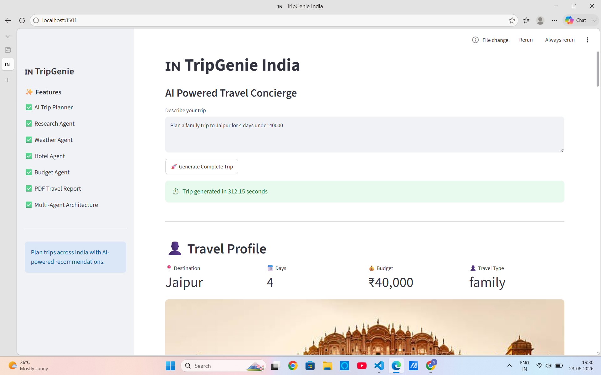
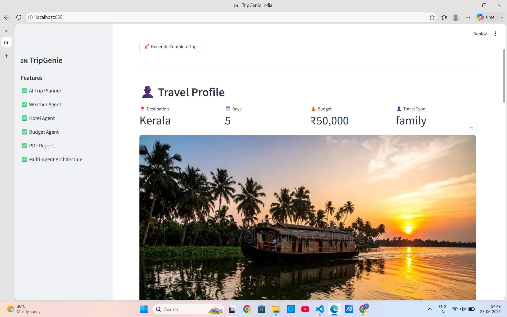
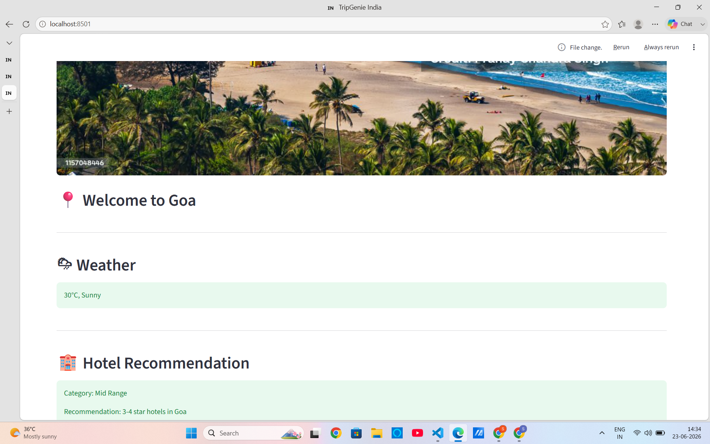
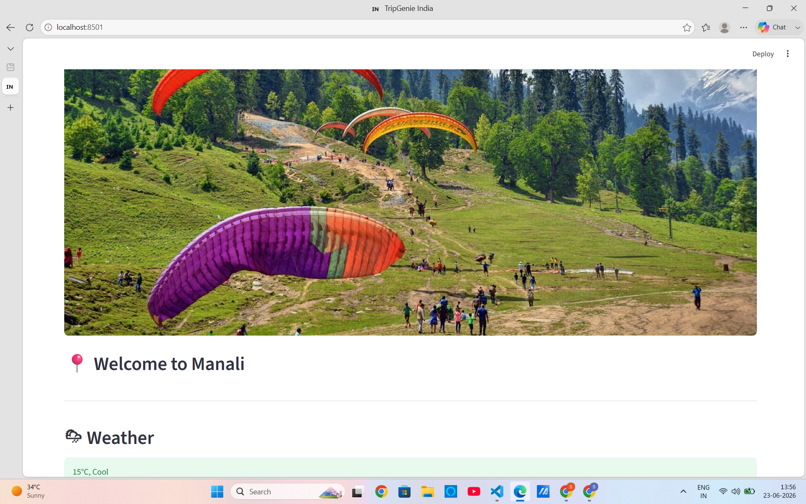

# TripGenie India IN

### AI-Powered Multi-Agent Travel Planning System

TripGenie India is an intelligent travel planning platform that generates personalized travel itineraries, destination insights, hotel recommendations, budget planning, packing checklists, and downloadable travel reports using a Multi-Agent AI Architecture.

---

## 🚀 Features

### 👤 Profile Extraction Agent

Extracts:

* Destination
* Duration
* Budget
* Travel Type

### 🔍 Research Agent

Provides:

* Best time to visit
* Top attractions
* Popular foods
* Adventure activities
* Travel insights

### 🗺️ Planner Agent

Generates:

* Day-wise itinerary
* Sightseeing plan
* Food recommendations
* Activities

### 🌦️ Weather Agent

Provides destination weather information.

### 🏨 Hotel Agent

Recommends accommodation based on budget.

### 💰 Budget Agent

Creates a detailed budget breakdown.

### 🎒 Packing Checklist Agent

Generates destination-specific packing suggestions.

### 📄 PDF Report Generator

Exports the complete travel plan as a downloadable PDF.

---

## 🏗️ Multi-Agent Architecture

```text
User Query
    │
    ▼
Profile Extraction Agent
    │
    ▼
Research Agent
    │
    ▼
Travel Supervisor
    ├── Planner Agent
    ├── Weather Agent
    ├── Hotel Agent
    ├── Budget Agent
    └── Packing Agent
    │
    ▼
PDF Generator
    │
    ▼
Streamlit Dashboard
```

---

## 🛠️ Tech Stack

* Python
* Streamlit
* Ollama
* Qwen 2.5
* ReportLab
* Multi-Agent Architecture

---

## 📸 Project Screenshots

### Home Page


### Travel Plan Generation


### PDF Report

## 📸 Project Screenshots

### Jaipur Trip



### Kerala Trip



### Goa Trip



### Manali Trip



## 📂 Project Structure

```text
TripGenie-India/
│
├── agents/
│   ├── profile_agent.py
│   ├── planner_agent.py
│   ├── research_agent.py
│   ├── weather_agent.py
│   ├── hotel_agent.py
│   ├── budget_agent.py
│   └── packing_agent.py
│
├── supervisor/
│   ├── intelligent_supervisor.py
│   └── travel_supervisor.py
│
├── assets/
├── screenshots/
├── reports/
├── utils/
├── app_v2.py
└── requirements.txt
```

---

## ▶️ Installation

Clone the repository:

```bash
git clone https://github.com/Sonali1554/TripGenie-India.git
```

Move into project directory:

```bash
cd TripGenie-India
```

Install dependencies:

```bash
pip install -r requirements.txt
```

Run the application:

```bash
streamlit run app_v2.py
```

---

## 🎯 Sample Query

```text
Plan a family trip to Jaipur for 4 days under ₹40,000
```

---

## 🌟 Future Enhancements

* Flight Recommendation Agent
* Travel Tips Agent
* Interactive Maps
* Real-Time Weather API
* Hotel Booking API
* Memory-Based Personalization

---

## 👩‍💻 Author

**Sonali Kumari**

* GitHub: https://github.com/Sonali1554
* LinkedIn: https://www.linkedin.com/in/sonali-kumari1207/

---

Built with ❤️ using Python, Streamlit, Ollama, and Multi-Agent AI.
